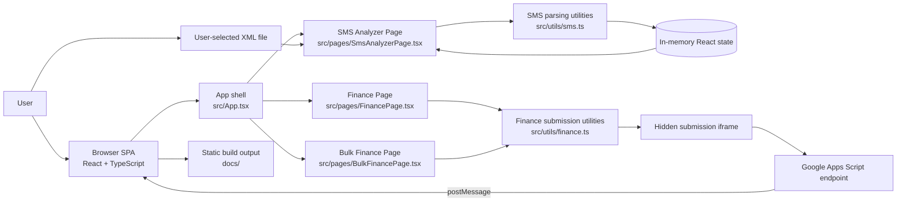

# Architecture

This repository is a client-side utility hub built with `Vite`, `React`, and `TypeScript`. The application runs entirely in the browser and presents three tools behind a shared shell: an SMS XML analyzer, a single-transaction finance form, and a bulk finance form. Navigation is hash-based, and most state is held in React component state rather than persisted inside this repository.

There is no application server, queue, Lambda, or database implemented in the codebase. The only runtime integration outside the browser is the finance submission flow, which posts form data to a configured Google Apps Script web app URL and waits for a `postMessage` confirmation. SMS analysis is fully local: the user selects an XML file, the browser parses it with `DOMParser`, and the resulting rows are rendered and filtered in-memory with AG Grid.

## Component Diagram

Notes:
- Implemented internal components are the SPA shell, page components, and utility modules.
- The Google Apps Script endpoint is referenced by configuration in [src/constants.ts](/E:/Learnings/Projects/js-tools/src/constants.ts:3) but is not part of this repository.
- The `docs/` directory is the Vite build output configured in [vite.config.ts](/E:/Learnings/Projects/js-tools/vite.config.ts:3), while `documents/` is documentation content.

## Request / Interaction Flow

### SMS analyzer flow

1. The app boots from [src/main.tsx](/E:/Learnings/Projects/js-tools/src/main.tsx:1), registers AG Grid modules, and renders the SPA inside `HashRouter`.
2. [src/App.tsx](/E:/Learnings/Projects/js-tools/src/App.tsx:31) derives the active view from `window.location.hash` and renders `SmsAnalyzerPage` for `#/sms-analyzer`.
3. The user selects or drops an XML file. `handleFile` in [src/pages/SmsAnalyzerPage.tsx](/E:/Learnings/Projects/js-tools/src/pages/SmsAnalyzerPage.tsx:273) reads the file text in the browser.
4. `parseXmlContent` in [src/utils/sms.ts](/E:/Learnings/Projects/js-tools/src/utils/sms.ts:189) parses `<sms>` nodes with `DOMParser`, then `parseSmsNode` enriches each record with derived fields such as bank, category, vendor, vendor category, and parsed amount.
5. Parsed rows are stored in React state, displayed through AG Grid, and further reduced into dashboard metrics, bank/category counts, and timeline chart data.
6. Filters and sorting are applied inside the grid plus a custom external filter, and the currently visible rows can be exported as CSV with `gridApi.exportDataAsCsv`.

### Finance submission flow

1. `App` renders either `FinancePage` or `BulkFinancePage` based on the hash route and also mounts one hidden iframe named `financeSubmitFrame`.
2. The page component builds a payload from form state. Single-entry validation happens in `buildSingleFinancePayload` and bulk-row validation happens in `getTransactions`.
3. `submitFinancePayload` in [src/utils/finance.ts](/E:/Learnings/Projects/js-tools/src/utils/finance.ts:4) creates a hidden HTML form, targets the iframe, and submits a `POST` request to the configured Google Apps Script URL.
4. The browser waits for a `message` event whose payload includes `source: "finance-apps-script"`. If that confirmation arrives before the timeout, the UI shows success and resets its form state; otherwise it shows an error.

## Key Architectural Decisions

- Browser-only processing for SMS analysis: XML parsing and enrichment happen locally in the client, which avoids any backend dependency for uploaded SMS data and keeps the flow immediate.
- Hash-based navigation: the app uses `HashRouter` and explicit hash parsing in [src/App.tsx](/E:/Learnings/Projects/js-tools/src/App.tsx:11) to stay compatible with static hosting, including GitHub Pages-style deployments.
- External form-post integration for finance writes: finance data is not sent with `fetch`; instead, the app submits an HTML form to a hidden iframe and waits for `postMessage`. This matches an Apps Script style integration where cross-origin form posts are simpler than a same-origin API.
- In-memory state over persistent storage: all working data lives in React state. Uploaded SMS rows, filters, and finance form values are not persisted in local storage or a backend implemented here.
- Mixed sync and async interaction paths: SMS parsing is asynchronous only for file reading, then synchronous in-memory transformation; finance writes are asynchronous and network-dependent because the UI must wait for an external confirmation message or timeout.

## Tech Stack

| Area | Technology | Where Found | Purpose |
| --- | --- | --- | --- |
| Language | TypeScript | [package.json](/E:/Learnings/Projects/js-tools/package.json:1) | Application and utility implementation |
| UI library | React 19 | [package.json](/E:/Learnings/Projects/js-tools/package.json:1) | SPA rendering and state management |
| Build tool | Vite | [vite.config.ts](/E:/Learnings/Projects/js-tools/vite.config.ts:1) | Development server and static build pipeline |
| Routing | `react-router-dom` `HashRouter` | [src/main.tsx](/E:/Learnings/Projects/js-tools/src/main.tsx:14) | Client-side route compatibility on static hosting |
| Data grid | AG Grid Community | [src/main.tsx](/E:/Learnings/Projects/js-tools/src/main.tsx:4) | Sortable, filterable SMS results table |
| Icons | `lucide-react` | [package.json](/E:/Learnings/Projects/js-tools/package.json:1) | Navigation and action icons |
| Styling | Custom CSS | [src/styles.css](/E:/Learnings/Projects/js-tools/src/styles.css:1) | Layout, responsive UI, chart/table appearance |
| XML parsing | Browser `DOMParser` | [src/utils/sms.ts](/E:/Learnings/Projects/js-tools/src/utils/sms.ts:190) | Parse uploaded SMS export files |
| External write integration | Google Apps Script web app | [src/constants.ts](/E:/Learnings/Projects/js-tools/src/constants.ts:3) | Receives finance transaction submissions |
| Deployment artifact | Static site output in `docs/` | [vite.config.ts](/E:/Learnings/Projects/js-tools/vite.config.ts:6) | Built files for static hosting |
